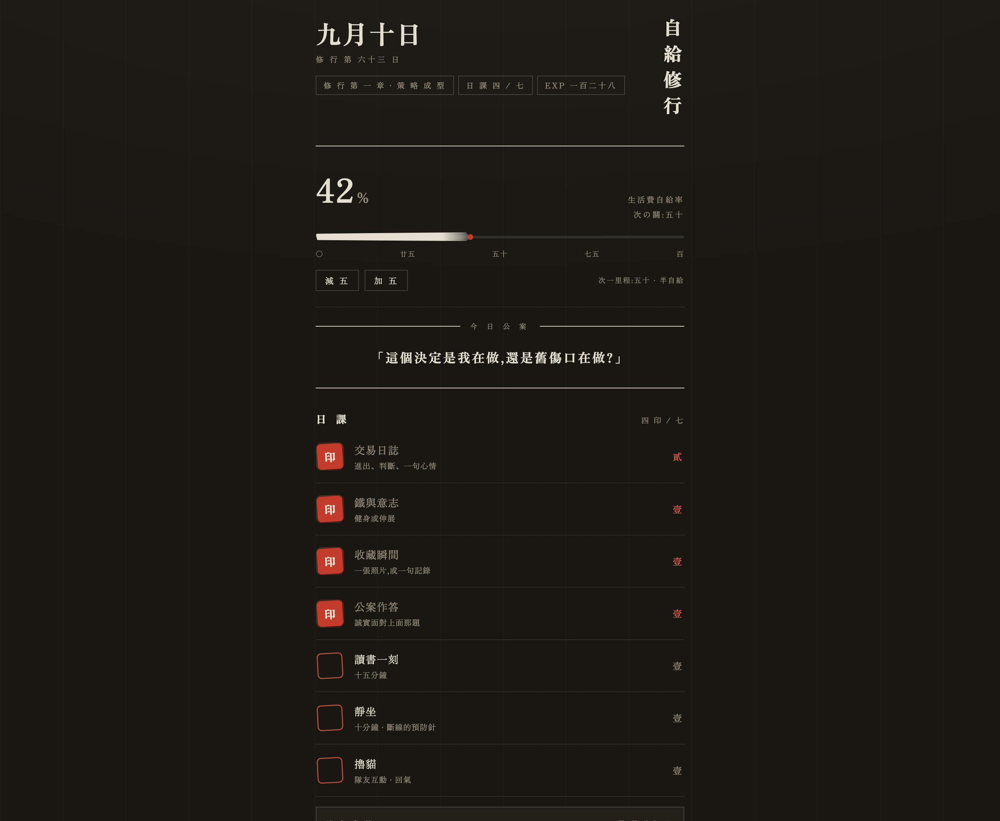

# SEAN: Self-Funded · 自給修行

[繁體中文](README.zh-TW.md)

A single-file daily dashboard, built to look like a Japanese dojo. It doesn't count how many things I got done today. It tracks one number: **what share of my own living costs I currently cover.**

**Live: [sean-rpg.pages.dev](https://sean-rpg.pages.dev)** — a PWA. Installable to a phone home screen, opens offline.



<sub>Sample data. Finishing a task presses a vermilion seal; the percentage at the top is the only progress bar that counts.</sub>

---

## Why I built it

I've quit every habit app I've installed, and the reason was never a missing feature. It's that **checking a box stops meaning anything.** They push you along with points and streaks, and about three weeks in you notice you're only doing things to keep a number from breaking. Then one day it lands that the points buy you nothing, and you never open the app again.

So this dashboard puts the weight on **the act, not the score.** Finish something and you press a seal: it resists, it makes a sound, and it can't be taken back. Thirty of them laid out in a grid is its own evidence.

There is still EXP and a streak counter in here — I'll be honest, I didn't manage to quit the mechanic entirely. But they're deliberately pushed behind the typography. EXP is written in Chinese numerals (十五, 三十五) instead of a big number that ticks up. The thing at the top, in the largest type on the page, is the self-funding percentage, because that's the number I actually want to look at.

The other half of the reason: I'm learning to trade, and I needed somewhere that forces me to write down, daily, whether a given entry followed my rules or was a gut call. No off-the-shelf tool does that, so I wrote one.

## What's in it

- **Self-funding bar** — 0 → 100%, the main quest. I move it by hand in steps of 5; it isn't wired to a bank account, and I'd rather set it deliberately than have it computed from noisy numbers.
- **Daily / weekly / chapter tasks** — seven daily, three weekly, three long-running goals that span months. All seven daily seals in one day is a "perfect day."
- **Seal scroll and ink chart** — the last thirty days of perfect days, plus a seven-day bar chart of how many seals landed each day.
- **Closing ritual** — press *seal the day* and the day's record **actually becomes read-only**, not merely greyed out. No backdating a check-in.
- **Six achievements** — three fire automatically when a threshold is crossed. The other three are manual, and to claim one you press and hold for 800 ms and then confirm. You can't tap one by accident.
- **The day rolls at 04:00** — not midnight. Something finished at 2 a.m. counts for the previous day.
- **Storage degrades in three steps** — cloud → localStorage → in-memory. No layer failing can stop you checking something off.

There's also a bell you ring when you catch yourself lost in short-form video, a "dust" counter that fills up on days you only prepared and shipped nothing, a hanging scroll of quotes I can add to, and an omikuji fortune (70% / 25% / 5%) drawn once on each perfect day. Those are for me, and I use all of them.

## Quick start

No build step and no `package.json`.

**Just to look at it** (no tooling needed; saves go to localStorage):

```bash
git clone https://github.com/seanlu2006/sean-rpg.git
cd sean-rpg/public
python3 -m http.server 8000    # http://localhost:8000
```

**With the API and database** (needs Node):

```bash
# 1. Create the local table. --local is a simulated D1; it never touches production.
npx wrangler d1 execute sean-rpg-db --local --file=db/schema.sql

# 2. Set a local passphrase. .dev.vars is already gitignored.
echo 'RPG_KEY="a passphrase you will remember"' > .dev.vars

# 3. Run it. Don't pass a directory — wrangler.toml already sets pages_build_output_dir.
npx wrangler pages dev          # http://localhost:8788
```

**Deploying:** Cloudflare Pages is connected to this repo's `master` branch, so a push deploys in about 20 seconds. The production `RPG_KEY` lives in the Pages dashboard under Settings → Variables and secrets, typed as a Secret. **Changing a secret doesn't take effect until you redeploy.**

One-time steps, only needed when rebuilding the whole environment:

```bash
npx wrangler login
npx wrangler d1 create sean-rpg-db      # put the returned database_id into wrangler.toml
npx wrangler d1 execute sean-rpg-db --remote --file=db/schema.sql
```

## Architecture

One HTML file on the front, one function on the back, one table in the database. No dependencies, no bundler.

| Layer | What | Why |
|---|---|---|
| Frontend | Single HTML file, 1,377 lines, CSS and JS inlined | No toolchain means no toolchain to rot. It'll still open in two years |
| Hosting | Cloudflare Pages | Static hosting is free; a push deploys |
| API | Pages Functions (`/api/save`) | Same origin as the frontend, so no CORS to deal with |
| Database | Cloudflare D1 (SQLite) | One person's dashboard. One table, one row is enough |
| Offline | Service Worker + PWA manifest | It acts like an app on a phone and opens without a network |

### How the data moves

The entire state is one JavaScript object in the browser. Syncing turns it into a JSON string, unchanged.

```
browser (public/index.html)
   │  fetch, with an X-RPG-Key header
   ▼
/api/save  (functions/api/save.js)
   │  compared against env.RPG_KEY (a Cloudflare secret)
   ▼
D1 table `saves`, one fixed row, id = 'sean'
```

- **Read** — on load, if a passphrase is stored locally, `GET /api/save`. Success means cloud mode.
- **Write** — any action schedules a `PUT /api/save`, debounced 1.5 s. A failed write falls back to localStorage. Only cloud mode debounces; local mode writes synchronously.
- **Degrade** — no passphrase set means straight to localStorage. If localStorage itself is unavailable (private browsing, say), it drops to memory.

The task ids (`trade`, `iron`, `m_boss`, …) are what save compatibility rests on: **rewording a task is fine, renaming its id orphans every past record.**

### Two decisions worth explaining

**1. Only `public/` gets deployed. Everything else stays in the repo but never ships.**

`wrangler.toml` sets `pages_build_output_dir = "public"`, so the CDN holds the dashboard and the PWA assets and nothing else. `db/*.sql`, `wrangler.toml` and this README stay in the repo — it's public, you can read them on GitHub — but **the live site does not serve them.** The reasoning is that a deployment should contain only what it needs to run: `db/seed-save.sql` contains my actual save data, and it has no business sitting on a CDN.

You can check it yourself — `curl https://sean-rpg.pages.dev/db/schema.sql` returns `index.html`, not the SQL.

`functions/` is the one exception: it has to sit at the **repo root**, because Pages looks for it there rather than inside the output directory. I learned that the hard way.

**2. The save backend moved from a private GitHub repo to D1.**

The old version committed saves into a second private repo (`sean-rpg-save`) using a GitHub fine-grained token. The problem is that **the token had to live in localStorage on every device**: a new device meant retyping ninety-odd characters, an expiring token meant redoing that everywhere, and the credential sat in a browser the whole time.

Now the credential only exists server-side. `RPG_KEY` is a Cloudflare secret, and each device holds only a passphrase I can remember. Revoking every device is one secret change.

Comparing the passphrase uses a `safeEqual` that XOR-accumulates character by character rather than `===`. Honestly: across a network round trip in a JS runtime, the timing difference in `===` is close to unexploitable, so this is habit-forming more than necessary defence — and since it compares lengths first, the passphrase length still leaks.

The `sean-rpg-save` repo still exists as a historical backup. The dashboard no longer reads or writes it.

### When something breaks

```bash
curl -i https://sean-rpg.pages.dev/api/save
```

A `401` means Functions are running and the route is wired up. **That's all it means** — `authed()` rejects before touching the database, so "the D1 binding is gone" and "`RPG_KEY` was never set" both look identical from outside. To tell them apart, retry with the correct passphrase, or read the Functions log in the Pages dashboard.

## Layout

```
sean-rpg/
├─ public/                 ← only this directory is deployed
│   ├─ index.html          the dashboard: CSS + JS inlined, one file
│   ├─ sw.js               service worker; same-origin assets only, skips /api/
│   ├─ manifest.json       PWA config
│   └─ icon-192.png, icon-512.png, apple-touch-icon.png
├─ functions/api/save.js   GET/PUT the save (must sit at the repo root)
├─ db/
│   ├─ schema.sql          table creation
│   ├─ seed-save.sql       one-time import of the old save (already run)
│   └─ repair.sql          one-time cleanup of data a bug corrupted (already run)
└─ wrangler.toml           Pages / D1 config
```

## Known limitations

These are trade-offs I chose, not a to-do list:

- **Single user, hardcoded.** One fixed row `id='sean'` in D1, no user system. Multi-user would mean a different data model.
- **Concurrent writes from two devices: last write wins.** There's no conflict detection. `updated_at` is stored, but nothing uses it yet — the frontend reads the response and throws that field away. One person almost never hits this; two tabs open at once will.
- **One shared passphrase is the whole auth story.** The endpoint is public. The `.dev.vars` example above suggests twelve characters, but **nothing enforces it** — the frontend only checks the field isn't empty, and the backend has no minimum length. Fine for a tool I use myself; not an auth design I'd ship to anyone else.
- **Saves are capped at 512K, over which the API returns 413.** The check is `text.length > 512*1024`, which counts UTF-16 code units, not bytes — so the constant name `MAX_BYTES` is wrong. For a save that's almost entirely Chinese, the real ceiling is closer to 1.5 MB of UTF-8. The frontend does nothing special with a 413; you'd just see the sync mark go to failed.
- **iOS Safari needs one interaction before any sound plays**, which is the browser's autoplay policy. The light/dark preference is stored in localStorage only and never syncs — dark on my phone and light on my desktop should stay independent.

## Known bugs

Found by reading the source against the README, still unfixed:

- **An offline local backup is silently discarded when you come back online.** A failed PUT writes state to localStorage, but `backendLoad()` returns the remote data directly on a successful cloud GET and never looks at that backup. So "edit offline → come back online" loads the older remote save and then overwrites the local one.
- **The keyboard bypasses the press-and-hold gate on achievements.** Manual achievements need an 800 ms hold with a mouse or finger, but the Space/Enter handler goes straight to the confirm dialog with no hold.
- **Achievements auto-granted in `rollover()` aren't saved immediately.** `checkAutoAch()` doesn't call `scheduleSave()`, so that seal waits for the user's next action before it persists.

## Design rules

A few rules the visual side keeps on purpose. They're written down because they're the ones I'm most likely to break myself:

- **Vermilion only ever means "you did it."** Never decoration, never a heading accent. Anything unfinished is a shade of ink.
- **Gold appears exactly once in the entire system**: the highest achievement in the seal register. A second occurrence is a bug.
- **Keep ambient motion near zero.** In principle only two things move on their own: the ember on the incense stick, and today's cell on the scroll. Everything else is triggered by the user. (There's still a third I haven't removed: the brush tip breathes when the percentage is within 5 of a milestone.)
- No emoji, no monospace, no floating drop-shadow cards. Hierarchy comes from rules, whitespace and letter-spacing.
- The press of a seal — animation, haptic buzz, low sine tone — is the anchor for how the whole thing feels. It must never become a fade-in or a checkmark.

### A note on the typography

The interface is set entirely in Chinese, in a serif face, and the title runs vertically down the right-hand edge the way a name is carved on a temple pillar. You don't have to read any of it to see what it's doing: heavy top-weighted numerals, hairline rules instead of card borders, wide letter-spacing on the small labels, and one saturated red reserved for a single meaning. The reference is a *goshuin* book — the stamp book a pilgrim carries between temples, where each visit is recorded with a red seal pressed into the paper by hand. That's the feeling the whole interaction is built around: you don't tick something off, you stamp it, and the stamp doesn't come off.

## License

[MIT](LICENSE). Copy it, change it, use it.

---

> This is a tool I built for myself, so the tasks, the koans and the quotes are mine. If you want to make it yours, all of that content sits in the constants at the top of `public/index.html` — `DAILY`, `WEEKLY`, `MAIN`, `ACH`.
